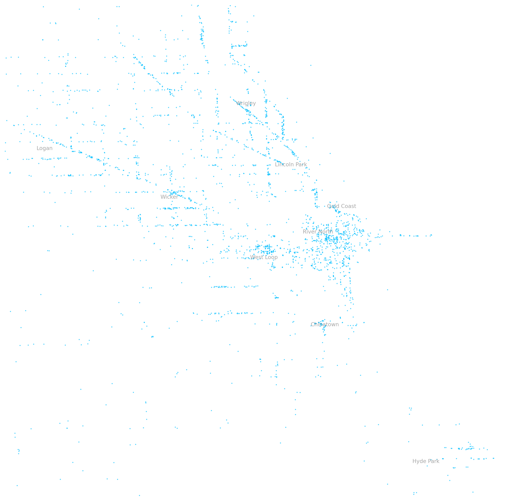

# Chicago Nightlife Density Map

---

## Project Overview

This project visualizes the distribution of bars, pubs, breweries, and nightclubs across Chicago, using OpenStreetMap data and Python.

Over 2,700 nightlife venues are mapped inside a custom bounding box focused on Chicago’s urban core, with key neighborhoods labeled for context.

---

## Data Source

- OpenStreetMap (queried via OSMnx)

---

## Bounding Box

| Direction | Boundary |
|:----------|:---------|
| **North** | W Peterson Avenue |
| **South** | W 63rd Street |
| **West** | N Pulaski Road |
| **East** | Jackson Park |

---

## Visualization Details

- **Tiny Blue Dots:** Each venue plotted as a minimalist dot
- **Background:** Pure white
- **Neighborhood Labels:** Wicker Park, River North, Gold Coast, West Loop, Lincoln Park, Logan Square, Hyde Park, Chinatown, Wrigley Field
- **Output Format:** High-resolution PNG for potential print/export

---

## Tools Used

- Python 3.11
- OSMnx
- Matplotlib
- Pandas

---

## Files

| File | Description |
|:-----|:------------|
| `Chicago_Nightlife_Map.png` | Final visualization of Chicago nightlife density |
| `Chicago_Nightlife_Map.ipynb` | Full code for data pull, cleaning, and plotting |

---

## Author

**North Branch Media**  
[media@northbranch.co](mailto:media@northbranch.co)

---

*This project was created for educational and visualization purposes.*
